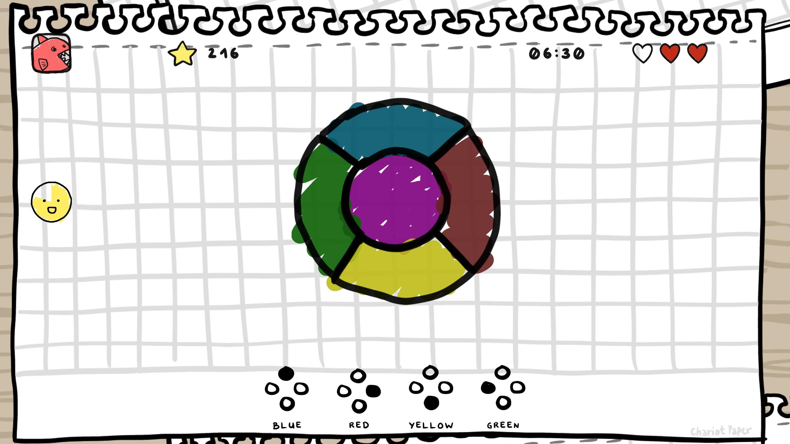
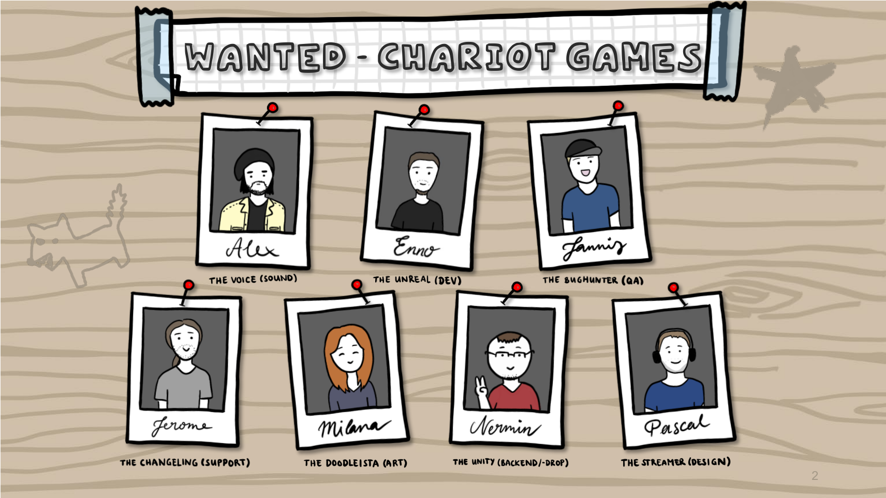

#  Intro
Are you ready to test your concentration like never before?

Our cute doodle-style game may seem easy to control, but trust us, it's harder than you think! With parallel mini-games that cover memory, reaction, cognition, and rhythm, you'll be hooked on the challenge. See for yourself how long your brain can last before its capacity fades out, only to become stronger for the next run.

Designed to simulate simple tasks, these mini-games come together to create an addictive and mind-bending experience. Come to our booth at HTW Berlin, H001 on 04.08.23 and put your concentration to the test. Let the concentration games begin!

# About 

As part of this semester's bachelor projects, our team picked the game-related Topic 'Konzentration durch Minispiele' (Fostering concentration via Minigames). The topic was very loosely defined: design a plethora of minimalistic play-elements that can be combined together to form complex, mind-boggeling (kinda) "games" to train concentration. 
The open nature of the topic allowed us to unleash our creativity and design skills, while being dreadful in terms of planning and agreement at times.

During some research and experimentation with the first game elements, we came to the agreement to make more than elements themselves, but still rather simple games and combine those. While on their own, most games may seem easy or even not engaging. But don't let that first impression fool you! 
By being virtually from different genres and requiring different kinds of attention, played in parallel they do require a certain amount of skills and a lots of concentration. With each additional game added to the roster, the chances for unexpected combinations and thus new challenge-ground for the mind arises.

## Features

- ### **Game-Modes**

The game is divided into two segments: 
The first is the single game mode, where each of our games can be played separately from others, allowing new players to familiarize themselves with each game and enjoy the hand crafted doodle graphics. 

 

Then there is the heart-pices: the parallel mode where you can play until you run out of hearts or your brain crashes down. In this mode, two randomly selected games of matching genres are displayed in parallel on the right and left side, respectively, and can be played simultaneously. See for yourself how long you can last.

- ### **Game Genres**

During our research and preparation for the project, we discovered four types of attention, which we used to define our game genres:

    - Reaction, games that test your reflexes;
    - Memory, (obviously) tests your memory (duh!:);
    - Cognition, tests your ability to deduce information;
    - Rhythm, tests your feel for the beat.

By being virtually from different genres and requiring different kinds of attention, played in parallel they do require a certain amount of skills and a lots of concentration. With each additional game added to the roster, the chances for unexpected combinations and thus new challenge-ground for the mind arises.

- ### **Adaptive Difficulty System**

Similarly, our game offers two ways of dealing with difficulty: 
The classic one, where you pick it yourself amongst the usual suspects found in most other games: easy, medium, and hard. 

Or you can let the internal Game Manager do that for you, and try out our "Varying" mode - where the difficulty is upgraded dynamically the better the player is, and if you fail too often, the difficulty is downgraded.

- ### **Scores and Times**

What a great game can do without high scores, collecting points, and a pressuring timer? Exactly! That's why we have them, too.

But we used them for "scientific reasons." ;) 
The points incentivize you to stay engaged in playful testing of your concentration, while the high scores indirectly show your progression and improvement of concentration by constantly reaching higher values. 
Each game has its own designated timer - a dreaded sight at the beginning - to keep you at your toes. Then there is an overall play timer, a great measuring tool, showing your brain's endurance in the end.

### **An EasterEgg**

It is tradition that games contain some form of Easter Egg (historically, to promote the creator/s). Can you find it?
 
Hint: *You need to use your hightened concentration and focus on details ;)*

# The Team

Allow us to introduce our remarkable team of 7 IMI students, while all being versatile and involved in every step of the development, each one is wielding a unique title and expertise that makes us an unstoppable force in project management and app development.

- ### [Enno - The Unreal (Management)](https://github.com/Ennjoying)

Representing the pack as our talented de-facto Project Manager, Enno navigates the complexities of our endeavor with finesse and precision. Under his guidance, our project takes shape and flourishes.

- ### [Jannis - The Bughunter (QA)](https://github.com/boTimPact)

No good software project would fail without a good bughunter. Jannis fearlessly delves into every nook and cranny of our creation, ensuring that pesky bugs are detected and squashed before they can wreak havoc on our masterpiece.

- ### [Alex - The Voice (Sound)](https://github.com/AlexanderStae)

Meet Alex, a true vocal virtuoso. His deep, well-sounding voice adds a captivating auditory dimension to our app. Without relying on sound-apps or instruments, Alex weaves mesmerizing sounds that elevate the user experience to new heights.

- ### [Milana - The Doodleista (Art)](https://github.com/milanatran)

Milana brings her flair to the table, adorning our project with delightful visuals, painstakingly handcrafted with love and passion. Her unique and captivating artistry adds a magical touch that enchants and draws users in.

- ### [Pascal - The Streamer (Design)](https://github.com/Larry-Master)

Pascal takes charge of the app's technical design elements. With a keen eye for play mechanics, game design and understanding of Unity, he keeps our app running like a well-oiled machine.

- ### [Jerome - The Changeling (Web, PR & Support)](https://github.com/Bigfoot52)

Jerome, our jack-of-all-trades, takes on the roles of Web Design, PR Department & Support. He seamlessly transitions between web design, gathering required materials for the fair and providing unwavering support to ensure our project's success.

- ### [Nermin - The Unity (Backend)](https://github.com/n-c0de-r)

Last but not least, we have Nermin, who works behind the scenes, weaving the code that brings our app to life. His technical prowess ensures a seamless and robust backend.

Together, we form a powerhouse team, dynamically dividing tasks according to ability and interest. This approach allows each team member to grow and excel in their chosen area while fostering a collaborative and supportive environment.

As we embark on this thrilling journey of app development, we stand united, ready to conquer any challenges that come our way - like a rushing chariot. Our passion, dedication, and diverse expertise drive us forward, bringing our vision to life with unrivaled excellence - like the The Wagon pointing to the North Star.

Stay tuned as we unveil our creation, a masterpiece born from the harmony of our skills and the camaraderie of our team. The world won't know what hit them!

# Future 

In the future, we have some exciting plans in store! Our commitment to continuous improvement and innovation drives us to explore new horizons and bring you a gaming experience like no other. 
The future of our game is boundless, and we can't wait to share it with you!

- ### More Games
The more the better! 
we strive to doubke or even triple the game count - exponentially raising the number of combinations to play. Keeping players engaged potentially endlessly!

- ### Multiplayer Support

We're gearing up to introduce a highly-anticipated multiplayer mode, where you can engage in thrilling gameplay with and against other players. Get ready to challenge your friends and foes, and take the competition to a whole new level!

- ### Mechanic Modifiers

As for the gameplay itself, we're not content with just scratching the surface. Brace yourself for a plethora of game mechanic modifiers that will take the challenge to mind-bending levels. Prepare to encounter mind-boggling obstacles like "mirroring inputs," where you'll need to coordinate your moves with a mirrored counterpart. Or dare to take on "reverse play," where everything you've come to know will be turned on its head.

But that's just the beginning. How about "alternating playstyles," where the rules change dynamically, keeping you on your toes throughout the gameplay? Or get ready for "exponential growth," where the difficulty level increases exponentially, pushing your skills to their limits.

And that's just the tip of the iceberg! We have a treasure trove of other modifiers in the pipeline, designed to make the challenge even harder for those who crave the ultimate test of their abilities.

- ### Accessibility Options

In the ever-evolving landscape of gaming, we are committed to ensuring that our game remains accessible to all players. We have a passion for inclusivity, and that's why we are actively working on future accessibility support. Our goal is to make the game enjoyable and engaging for everyone, regardless of their abilities or preferences. So get ready for a gaming experience that knows no bounds, with features tailored to cater to diverse players.

- ### Smart-Fridge Support (joke)

But that's not all. We want you to enjoy our game everywhere you go. That's why we're also working on an innovative smart fridge version. Yes, you heard it right! Now you can have the game at your fingertips, quite literally, no matter where you are. From your trusty smartphone to the convenience of your smart fridge, the fun never stops!

- ### 4K UHD Raytracing Visuals (joke)

And for those who crave cutting-edge visuals, we've got something special for you too. Our team is actively working on implementing Raytracing, a revolutionary feature that will elevate the gaming experience on high-end devices. Prepare to be blown away by the stunning graphics and immersive realism, making your gameplay even more captivating and breathtaking.

With a strong focus on innovation and user satisfaction, we are dedicated to continuously enhancing the game and bringing you the best possible experience. So stay tuned, because we're just getting started, and the future looks brighter than ever for our game!

# Thank You

We want to thank everyone for plaxing our game, reading this and thus becoming part of our exciting journey as Chariot Games.
